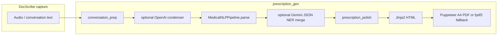

# DocScribe — clinical speech → transcript → structured prescription

**Team Baby Sharks — Witch Hunt Hackathon (2026)**  
End-to-end flow: **terminal or UI capture** → **Gemini transcription** (Doc/Patient dialogue) → **prescription pipeline** (rules + optional LLMs) → **hospital-style HTML/PDF**.

**Upstream DocScribe:** [github.com/itsthusharashenoi/DocScribe](https://github.com/itsthusharashenoi/DocScribe)

---

## Repository layout (hackathon monorepo)

DocScribe is intended to sit next to the NLP core used by the prescription generator:

```text
<repo-root>/
├── DocScribe/                 ← this folder (speech + scripts + prescription_gen)
│   ├── scripts/
│   │   ├── gemini-record-transcribe.sh
│   │   ├── prescribe_from_transcript.sh   # NEW: transcript .txt → PDF
│   │   └── _gemini_transcribe.py
│   ├── prescription_gen/      # structured Rx + templates + PDF
│   ├── recordings/            # gitignored — WAV output
│   ├── Transcriptis/          # gitignored — transcript .txt output
│   ├── vexyl-stt/             # optional offline STT
│   └── vexyl-stt-ui/          # optional browser UI
└── docscribe_akhil/           # REQUIRED sibling: rule-based Medical NLP (`nlp/medical_nlp.py`)
```

`prescription_gen/repo_paths.py` walks upward from `prescription_gen/` until it finds `docscribe_akhil/`. Install Python deps from `prescription_gen/requirements.txt`. For Puppeteer PDF, install Node dependencies at **monorepo root** (folder that contains `node_modules/puppeteer`) — `run.py` searches parents for that.

---

## Architecture (prescription pipeline)

High-level stages:



| Stage | Role |
|-------|------|
| **Transcriptis/*.txt** | Output of `gemini-record-transcribe.sh` — Doc:/Patient: lines (or verbatim mode). This file is the **input** to `prescription_gen/run.py`. |
| **conversation_prep** | Strip speaker prefixes, optional Devanagari→Roman transliteration (`indic-transliteration`), merge lines, boost clinical cues in long transcripts. |
| **LLM condenser** | Optional OpenAI pass when `OPENAI_API_KEY` is set (`--use-llm auto\|on\|off`). |
| **MedicalNLPPipeline** | Offline extraction: meds, symptoms, investigations, follow-up snippets, validation flags (`docscribe_akhil`). |
| **vitals_extract** | Heuristic vitals lines (BP, weight, SpO₂, etc.) from raw transcript text. |
| **Gemini NER** | Optional merge of JSON fields (`GEMINI_API_KEY` in `prescription_gen/.env`, `--use-gemini`). |
| **prescription_polish** | Dedupe meds (same brand stem), infer OD/HS from transcript, Devanagari gloss pass when Hindi source, prune stale INFO flags, vitals dedupe. |
| **Render** | `templates/prescription.html` → `filled_prescription.html` → `output.pdf` (multi-page A4; source transcript on a later page). |

Environment examples live in `prescription_gen/.env.example` (copy to `prescription_gen/.env`).

---

## Quick start — terminal capture + transcription

1. Install [ffmpeg](https://ffmpeg.org/) (e.g. `brew install ffmpeg`).
2. **API key:** `scripts/.env.secrets` with `GEMINI_API_KEY=...` (see `scripts/.env.secrets.example`).
3. From **this repo root** (`DocScribe/`):

   ```bash
   ./scripts/gemini-record-transcribe.sh
   ```

   Speak, then **Ctrl+C**. Outputs:

   - **`recordings/gemini-*.wav`**
   - **`Transcriptis/gemini-*.txt`** — transcript (Doc/Patient by default, or plain if `GEMINI_VERBATIM=1`)

   If a **patient name** is detected, the transcript may be renamed to **`<patient-name>-<timestamp>.txt`** and the `gemini-*.txt` file removed (see script output).

### Transcription environment variables

| Variable | Meaning |
|----------|---------|
| `GEMINI_VERBATIM=1` | Plain continuous text only (no Doc/Patient). |
| `LANGUAGE=hi-IN` | Optional soft locale hint (default `auto`). |
| `GEMINI_MODEL` | Override model id (default `gemini-2.5-flash`). |
| `SKIP_NETWORK_CHECK=1` | Skip connectivity probe before Gemini. |
| `GEMINI_JSON_RESPONSE=0` | Doc/Patient mode: disable JSON MIME hint if API returns 400. |
| `FFMPEG_AUDIO_DEVICE` | macOS only, e.g. `:1` if default `:0` is wrong. |
| `GEMINI_SKIP_PATIENT_RENAME=1` | Keep `gemini-<timestamp>.*` names. |
| `GEMINI_EXTRACT_MODEL` | Model for patient-name extraction (default: same as `GEMINI_MODEL`). |
| **`PRESCRIBE_AFTER_TRANSCRIBE=1`** | After a successful transcript, run `prescription_gen/run.py` on the **newest** `.txt` under `Transcriptis/`. |

---

## Quick start — prescription from transcript

1. **Python:** from repo root (parent of `DocScribe/`):

   ```bash
   pip install -r DocScribe/prescription_gen/requirements.txt
   ```

   Optional: `indic-transliteration` for better Hindi prep (see `requirements.txt`).

2. **Optional keys** in `DocScribe/prescription_gen/.env` (see `.env.example`):

   - `GEMINI_API_KEY` — NER merge after rules  
   - `OPENAI_API_KEY` — dialogue condenser before rules  

3. **PDF (Puppeteer):** at monorepo root, `npm install` (needs `puppeteer` in `node_modules`). If Node is missing or PDF fails, **fpdf2** ASCII fallback runs automatically.

4. **Run** on a transcript file:

   ```bash
   ./scripts/prescribe_from_transcript.sh
   # or explicit path + passthrough args to run.py:
   ./scripts/prescribe_from_transcript.sh Transcriptis/your-file.txt --use-gemini off
   ```

   Defaults write `prescription_gen/filled_prescription.html` and `prescription_gen/output.pdf`. Override with `--out` / `--html`.

---

## Optional: local offline STT (`vexyl-stt/`)

Patched [VEXYL-STT](https://github.com/vexyl-ai/vexyl-stt) for offline use — **not** required for the Gemini terminal flow.

## Optional: `vexyl-stt-ui/` (browser UI)

Legacy Vite + React client — not part of the recommended terminal workflow.

---

## License

`vexyl-stt/` retains upstream licensing (Apache 2.0). Other project files unless noted are MIT.
